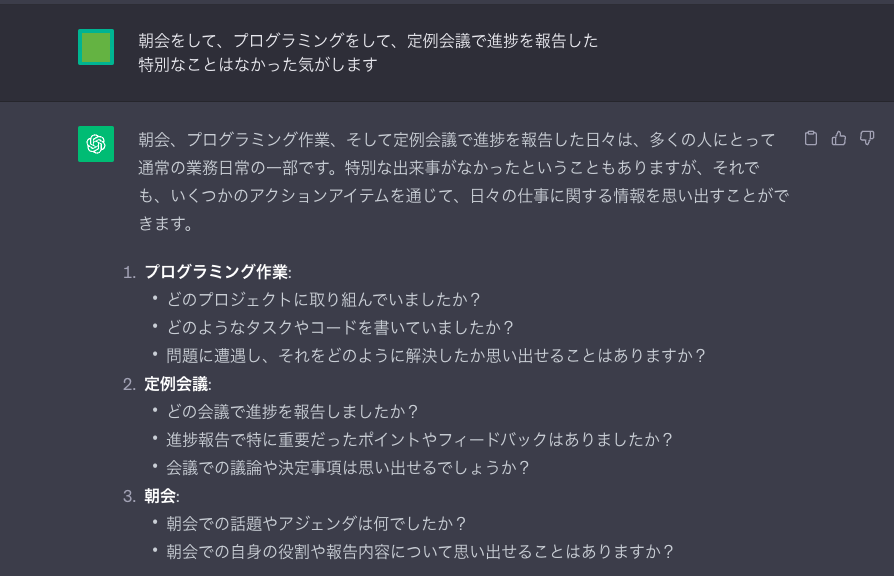

# LTで始めるコミュニケーション

パウリ / 株式会社 ビットキー VPoE Office /  EM、アジャイルコーチ、技術広報

## LTは自己開示である

本節では自己紹介とLTを比較しつつLTの立ち位置や行う意義についてお伝えします

### 自己紹介とLT

みなさんは自己紹介をする時に何を話しますか？

WEBで「自己紹介」と調べると「初めて会った人に、自分で自分の名前、経歴などをいって知らせること」（参考：コトバンク）とありました。

私は初めて会う方に自己紹介をするときには

「はじめまして、パウリです！株式会社ビットキーのVPoE OfficeにてEM、アジャイルコーチ、技術広報として活動しています。趣味はアニメ、ディズニー、カメラ、サウナ、ゴルフなど多趣味なので、趣味が被っている方は是非ヲタトークしましょう！」

と、こんな感じで上記の定義通りの自己紹介をしています。

一方LTはというと「**ライトニングトーク**（[英](https://ja.wikipedia.org/wiki/%E8%8B%B1%E8%AA%9E): Lightning Talks; LT）とは[カンファレンス](https://ja.wikipedia.org/wiki/%E3%82%AB%E3%83%B3%E3%83%95%E3%82%A1%E3%83%AC%E3%83%B3%E3%82%B9)や[フォーラム](https://ja.wikipedia.org/wiki/%E3%83%95%E3%82%A9%E3%83%BC%E3%83%A9%E3%83%A0)などで行われる短い[プレゼンテーション](https://ja.wikipedia.org/wiki/%E3%83%97%E3%83%AC%E3%82%BC%E3%83%B3%E3%83%86%E3%83%BC%E3%82%B7%E3%83%A7%E3%83%B3)のこと。（中略）持ち時間が5分という制約が広く共有されている。」（参考：wikipedia）とあり、カンファレンスやフォーラムでのLTでは、話す対象としては初対面の人が多い（あるいは初対面の方に対してを想定とする）でしょう。

このことから、それぞれの共通点は「初対面の人に何らかしらの情報を知らせること」、つまり**自己開示**と言えます。

多くの場合自己紹介は今後その自己紹介をする対象と良好な関係を築くために行いますが、LTはなんのために行うのでしょう？

コロンビア大学の心理学者アーサー・ゲイツ博士は、インプットとアウトプットの効率的な割合は「3：7」であると実験で突き止めました。この比率は、記憶を最も効率化する黄金比とされています。

当然LTを行うことはアウトプットにあたり、自身で得た知識や経験をアウトプットすることでその知識や経験を自身の学びとして定着することができます。

しかしLTで得られるメリットはこれだけではありません。

次項ではLTから始まるコミュニケーションについてご説明します。

### LTから始まるコミュニケーション

LTの機会としてあるカンファレンスやフォーラム、その他勉強会などでは、懇親会が用意されていることもあります。

例えばサッカー好きのあなたが「サッカー好きが一同に介す会」に参加し、数十名会場に集まったとします。

その中で突然懇親会が始まったとしたらどうでしょうか。

まず「誰に」「何の」話をするのかで迷い、とりあえず自己紹介をして相手との共通点であるサッカーの中でポジションや先述、チームワークなどさらなる共通点や考えの相違を探すところから始まると思います。

では前段にLTがあったらどうでしょう。

LTではAさんが「サッカーとフットサルの違いと共通点」を、Bさんは「フォワードがディフェンダーを経験してみて感じた景色」を、Cさんは「お酒を飲んでからサッカーして後悔したことを公開（激ウマギャグ）」を発表しました。

その上で懇親会が始まったとしたら、あなたや他の参加者はフットサルに興味があることからAさんに話を聞くかもしれないし、Bさんに他のポジションを試したことはあるか聞いたり、またテーマとは関係なくなんとなくCさんに話しやすさを感じお酒を酌み交わすかもしれません。

自己紹介では自身にラベリングされた情報、名前や役職、趣味（の名称）のみ伝えますが、LTではそれに加えて経験の一部を語ることで自身の考えやスタンスまで開示することができます。

このようにLTからその人のラベルからは読み取れない情報を得ることで、自然とコミュニケーションをとるきっかけとなります。

## LT資料の作り方

LTは自己開示であり、コミュニケーションのきっかけとして作用することを伝えてきました。

ここまででLTを行うことの意義はなんとなく理解できたかと思いますが、「どうLTの資料を作成すればいいのかわからない」という方もいます。

ここからはLT資料の作成方法についてお伝えします。

### LTやその他の発表資料を作成する前提

日報や朝会で「今日は何もしていない」や「昨日何をしたか覚えていない」という方がいます。

冗談で言っていることもあるかとは思いますが、LTなどの発表をするためには日々の活動を俯瞰して説明できる状態である必要があります。

自身が行ったことを自覚するために、日報などでは他者の目が気になってしまい本音がかけないと思うので、まずは日記などに今日あったことをまとめてみたり、エクスプレッシブ・ライティングなど自身の感情を思いのままに書くことから始めると、気付きが得られるかもしれません。

1日を終えた時には忘れてしまう人は、リアルタイムにメモをとったりメタ認知を高めるために瞑想を始めてみたり他のアプローチもありますが、ChatGPTを用いたコーチングを通して自分の記憶を呼び起こす手助けとすることもできます（図1）

目的に沿って自分にあった手法はなにか試してみましょう。

図1：ChatGPTを用いたコーチング例

### LTをまとめる際のフォーマット

LTの意義もネタのため方をわかったが、最初の一歩が踏み出せない！

そんな方のために「とりあえずそれっぽくなるフォーマット」として、A. LTのネタ整理、B. スライド構成を用意しました。

**A. LTのネタ整理**

1. 自分はどんなことを伝えられるのか
2. どういった経験からそう考えたのか
3. どんな人にこのLTを届けたいのか？
4. LTを聞いた人にどうなって欲しいのか？

具体例がないと分かりづらいと思いますので、実際に私が「X倍の速度で読了！？チームだからできるアクティブ・ブック・ダイアローグ！改」(https://speakerdeck.com/pauli/read-x-times-faster-active-book-dialogue-because-we-are-a-team-revision)という社外向けのLTをした際の資料作成の背景を例にしてみます。

1. 「ABD × ふりかえり」で早く確実に行動に移す手法を伝えたい
2. 経験
    1. チーム全員で輪読会をして、時間がかかったり、読んだ内容を思い出せなくなり、状況が変わらなかった
    2. 読書の速度を上げるABDというプラクティスを知った
    3. チーム内で試し、良い感触だったが、より行動につなげるためにはどうすればよいか考えた
    4. 隔週のふりかえりの際に見返せるようになっていると良いと思った
    5. 同じく困っている方にこれを試してみてほしいと思った
3. チームで輪読会を行なっているが、成果が出るのが遅い、知識の定着率が低い、行動に移らないと感じて困っている人。
4. 3. を楽しく解決できる状態になってほしい

次に上記でまとめたことを以下のスライド構成でまとめます

B. **スライド構成**

1. 前談
2. 題名
3. ストーリー
4. まとめ

では同じく上記の例でスライド構成に落とすと以下のようになります。

1. 2-1.を前段として共感を得る
2. 題名で1.をどう解決するのか気にさせる
3. 2-2から2-4を順次まとめる
4. まとめ

このような形でお使いのスライド作成ツールでまとめていくと、それっぽいLT資料になっているかと思います。

ちなみに私はVisual Studio Codeというエディター及びMarp for VS Codeというアドオンでスライドを作成しています。

これらのツールの詳しい説明は文量と執筆者の体力の都合で割愛させていただきますが、検索すれば使い方は出てくるので是非調べてみてください。

## まとめ

ここまでLTは自己開示でありコミュニケーションツールであること、実際のスライド作成方法をお伝えしました。

自身の学習効率という観点でも、人との繋がりを広げるという観点でも効果のあるLT。

読者のみなさんが本資料をもとにLTを行い、その内容をLTで発表することを期待しております。

まずはこの章を読んで何を感じましたか？早速メモしてみましょう！
